**Note：The sensors, modules and the 270° servo in each project are shared.**

# Project 01：Traffic Lights

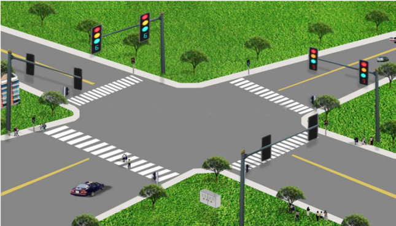

## 1. Introduction
I met a big traffic jam on my way to school today. The red light at the intersection where I waited lasted very long and the green light flashed a few times and then changed to yellow. It seems that there's something wrong with the traffic light's digital signal. 

Can we use a traffic light module to simulate the working principle of traffic lights?  

Let's take a look at the tools first.

## 2. Components
||||
| :--: | :--: | :--: |
|Kidsuno Mainboard×1|Traffic Light Module×1|Connection Wire×1|
||  | |
|USB Cable×1| Traffic Lights×1 | |
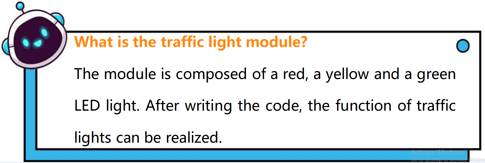

## 3. Component Knowledge
（1）Traffic lights are signal lights that command the traffic operation, which are generally composed of a red light, a green light and a yellow light. The red light means impassable, the green light means passable, and the yellow light means a warning.

（2）To keep the light on, the electricity is needed. When we say that there is electricity, we mean that there is current flowing through an electrical appliance like a light. Current comes to our home from the power station via wires. And the generator of a power station is the power supply, which enables to provide voltage and current. The battery we usually use is also the power supply. Wires can be used to conduct electricity, which connect a path for the current to flow. This path is called a circuit. If we want to make a lamp emit light, both a power supply and a complete circuit are needed.

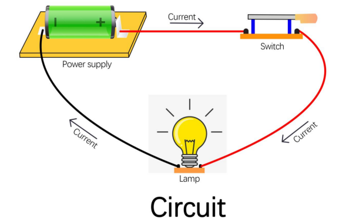

## 4. Installation of Traffic Lights

Please refer to the following link：[https://www.dropbox.com/preview/keyestudio%20Robot/6.Kidsbits/KD3017%20Kidsbits%20Intelligent%20Traffic%20System%20Kit%20for%20Arduino/4.%20Intelligent%20Traffic%C2%A0System%20Assembly/Project%2001%EF%BC%9ATraffic%20Lights/Installation%20Steps.pdf?context=content_suggestions&role=work](https://www.dropbox.com/preview/keyestudio%20Robot/6.Kidsbits/KD3017%20Kidsbits%20Intelligent%20Traffic%20System%20Kit%20for%20Arduino/4.%20Intelligent%20Traffic%C2%A0System%20Assembly/Project%2001%EF%BC%9ATraffic%20Lights/Installation%20Steps.pdf?context=content_suggestions&role=work)

## 5. Function: Light Up the Traffic Lights

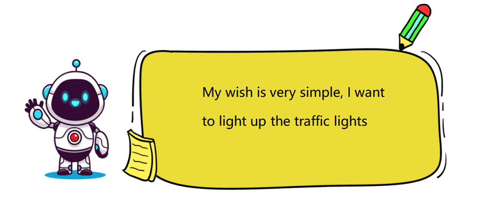

## 6. Wiring Diagram
Connect the kidsuno mainboard and computer via a USB cable, and connect the traffic light module to the No.1 interface of the mainboard.

## 7. Description of the Building Blocks

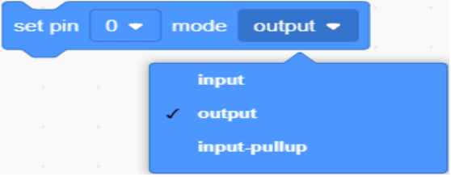

Set **input** or **output** to the specified pin. **input** means input mode,**output** means output mode. Select **input-pullup** can set the input mode for the pin and make it become high level.

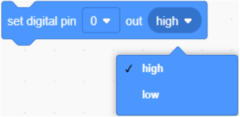

Set **high** or **low** to the specified pin. Select **high** means to set high level for the pin. If there is voltage and current, the LED will be on. Select **low** means to set low level for the pin. If there is no voltage and current, the LED will be off.

## 8. Write the Program

① Drag the instruction block in the **Events** module to the script area.

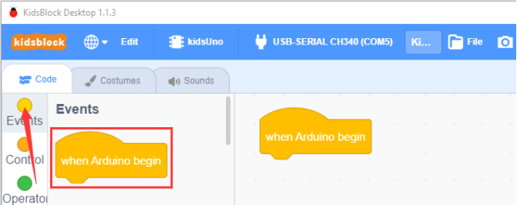

② Drag the instruction block in the **Pins** module to the script area and copy it twice. Since the interface of the traffic light module is connected to port 1 on the mainboard (the red light is connected to D3, the yellow light is connected to D5, and the green light is connected to D6), then change the number 0 to 3, 5 and 6 and **input** to **output** respectively.

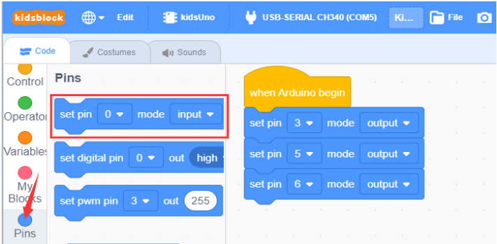

③ Drag the instruction block in the **Pins** module to the script area and copy it twice. Then change the number 0 to 3, 5, and 6 respectively.

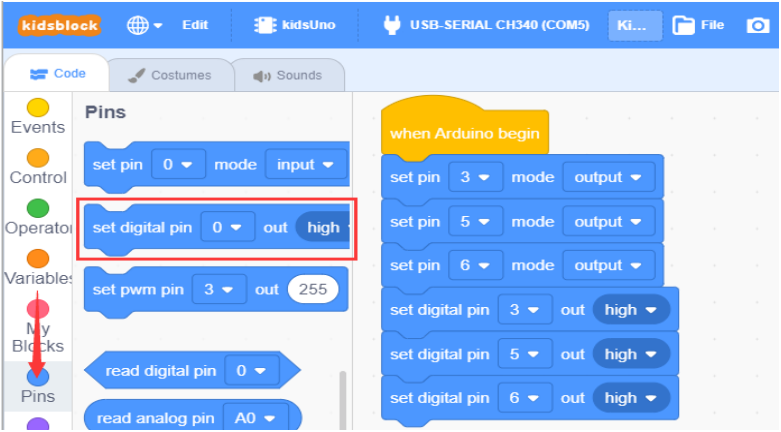

④ Complete Program

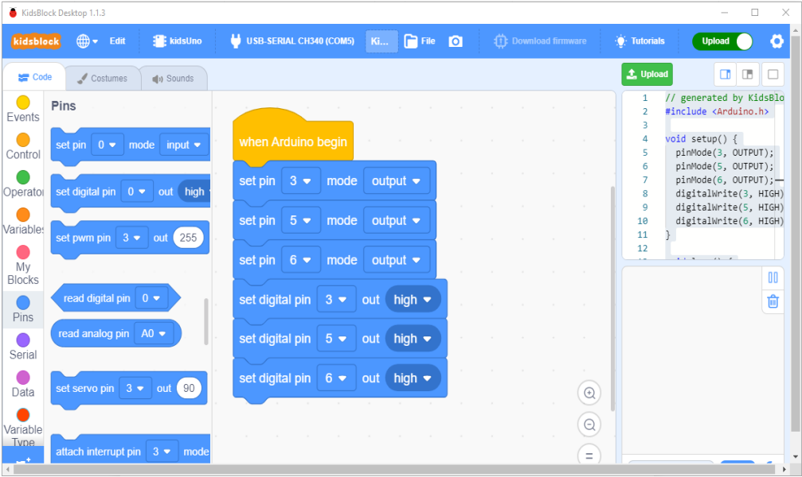

## 9. Test Result
Click  to upload the complete program to the kidsuno mainboard and power up, then the lights on the traffic light module will be on. It seems pretty amazing, right?

## 10. Function: Make the Traffic Lights On and Off

## 11. Description of the the Building Blocks

This is a delay block, and change the number 1 to the delayed time

## 12. Write the Program
①  Write the program according to the knowledge learned before and refer to the last program code.

② Drag the instruction block in the **Control** module to the script area. The number 1 can be changed to other numbers. Here, the number 1 is taken as an example.

③ Copy the code string once and change **high** to **low**.

④ Complete Program

## 13：Test Result 
Click  to upload the complete program to the kidsuno mainboard and power up, then the lights on the traffic light module will go on and then off.

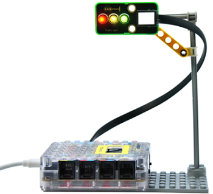

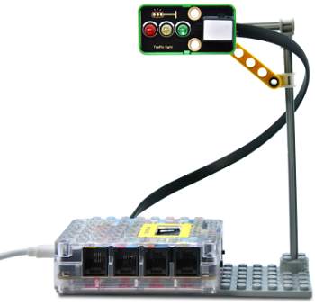

## 14. Function of Traffic Lights 

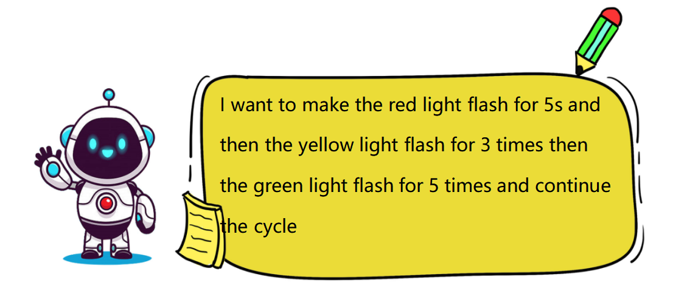

## 15. Flow Chart 
First set the three LED lights to off, then the red light will be on for 5 s then go off, then the yellow light will flash for 3 times then go off, then the green light will be on for 5 s then go off.

## 16. Description of the the Building Blocks

This is a loop statement: do a same thing over and over again.

This is a conditional loop control statement and it will exit the loop  when the number of loops is met. For example, 10 means 10 cycles, and the number 10 can be changed to other numbers.

## 17. Write the Program

① Find the instruction blocks

（1）
 

（2）
 

（3）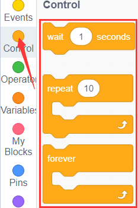
 

② Complete Program

## 18.Test Result 
Click  to upload the complete program to the kidsuno mainboard and power up, then the red light will be on for 5 s then go off, then the yellow light will flash for 3 times then go off, then the green light will be on for 5 s then go off and continue the cycle.

## 19. Extended Project

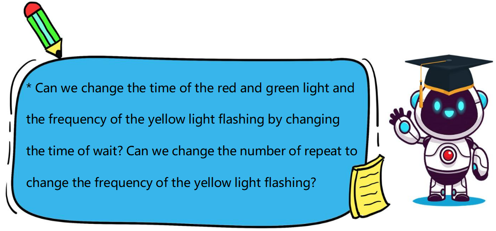

The extended sample code is below：

