# Project 03：Street Lamps

## 1. Introduction

Street lamps are ubiquitous in our daily life. For example, some public street lamps come on automatically at night and go off automatically during the day. Do you want to know why? Let’s make a small street lamp together. 

Look at the tools first.

## 2. Components

||||
| :--: | :--: | :--: |
|Kidsuno Mainboard×1|Photoresistor×1|White LED Module×1|
|||  |
|Connection Wire×2|USB Cable×1| Street Lamps×1 |

## 3. Installation Steps

Please refer to the following link：https://www.dropbox.com/scl/fo/whacdlki5y44kevau03qa/h?dl=0&rlkey=ogbigsw7lxv8zhkvr1oqhlkmz

## 4. Function: Detect the Light Intensity 

## 5. Wiring Diagram
Connect the kidsuno mainboard and computer via a USB cable, and connect the photoresistor to the No.7 interface of the mainboard and the LED module to the No.1 interface of the mainboard.

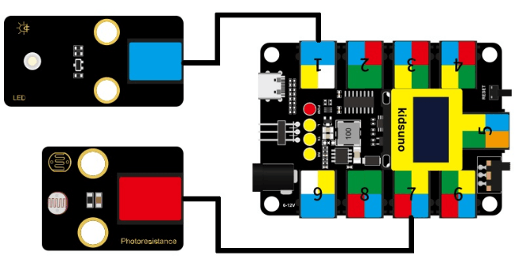

## 6. Description of the the Building Blocks

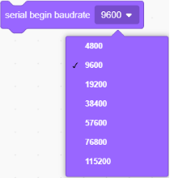

The block is used to set serial baud rate(generally, the baud rate 9600 is taken as an example)

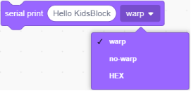

This block is used to set print mode for the serial port. **warp** means line feed printing, **no-warp** means no line feed printing, **HEX** means hexadecimal printing.

It is used to read the analog signal value of the specified pin（range：0~1023)

## 7. Write the Program

① Drag the instruction block in the **Events** module to the script area.

② Drag the instruction block in the **Serial** module to the script area and take the baud rate 9600 as an example.

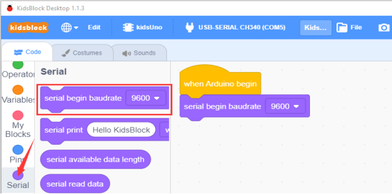

③ Drag the instruction block in the **Pins** module to the script area. Since the photoresistor is connected to pin A0 of port 7 on the mainboard, then change the number 0 to A0.

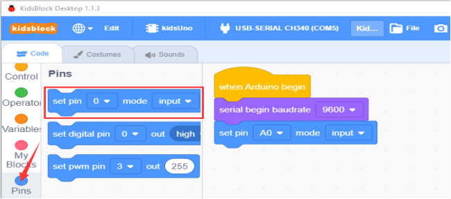

④ Drag the instruction block  in the **Control** module to the script area. 

⑤ Drag the instruction block in the **Serial** module to the script area.

⑥ Drag the instruction block in the **Pins** module to the script area and put it into the block .

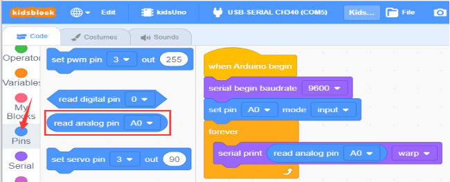

⑦ Drag the instruction block in the **Control** module to the script area and change the number 1 to 0.3.

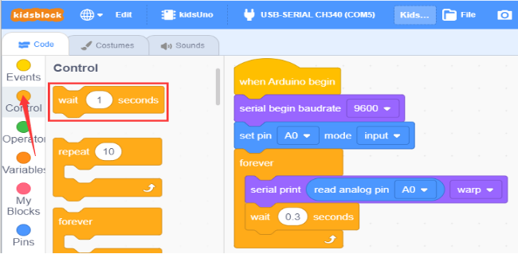

⑧ Complete Program

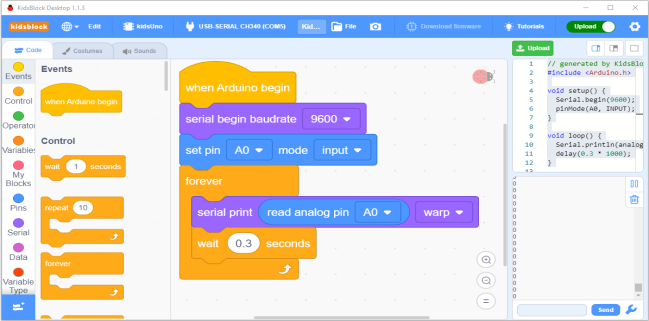

## 8. Test Result

Click  to upload the complete program to the kidsuno mainboard and power up, then click  in the serial monitor area to set the baud rate to 9600. Then the serial monitor will print the analog value read by the photoresistor. When the light intensity in the environment where the photoresistor is located gradually decreases, the analog value increases gradually, otherwise, the analog value decreases.

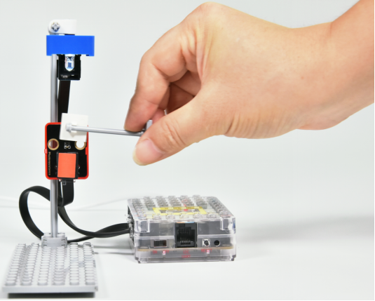 

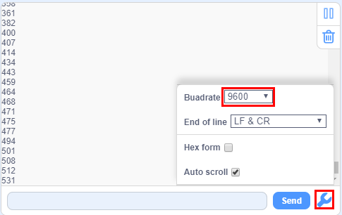

## 9. Function: Photoresistor Controls LED

## 10. Description of the the Building Blocks

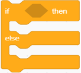

It is a conditional statement code executing if-then-else function: If the logical judgment statement in  is satisfied, the code statement below **then** is executed, otherwise, the code below **else** is executed.

## 11. Flow Chart 

First, set the LED to off. When the light intensity value read by the photoresistor is less than 200, the LED will be on, otherwise, it will be off.

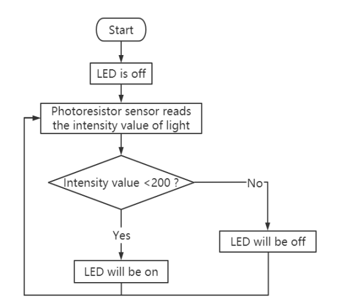

## 12. Write the Program

① Find the instruction blocks

（1）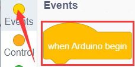
  

（2）
 

（3）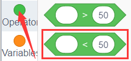
 

（4）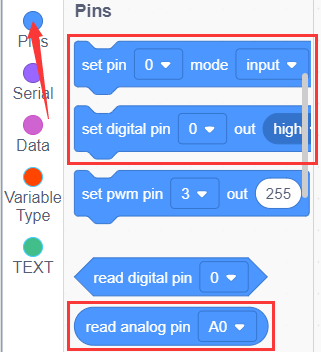
 

（5）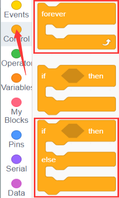
 

② Complete Program

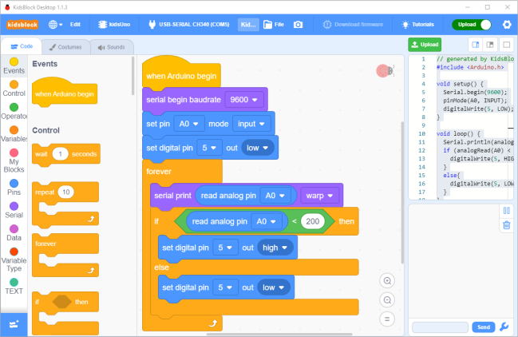

## 13. Test Result

Click  to upload the complete program to the kidsuno mainboard and power up, then use your hands to cover the photoresistor . When the light intensity value read by the photoresistor is less than 200, the LED will be on, otherwise, it will be off.

## 14. Extended Project

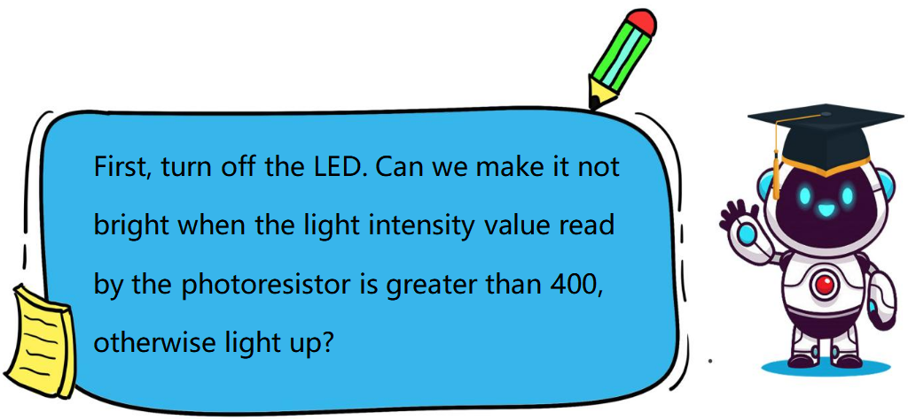

The sample code is below：

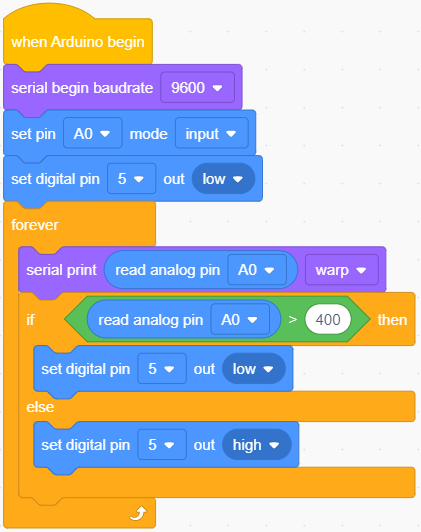

