# Kidsbits Intelligent Traffic System Kit 

**Note：The sensors and modules and the 270° servo in each project are shared.**
 
 
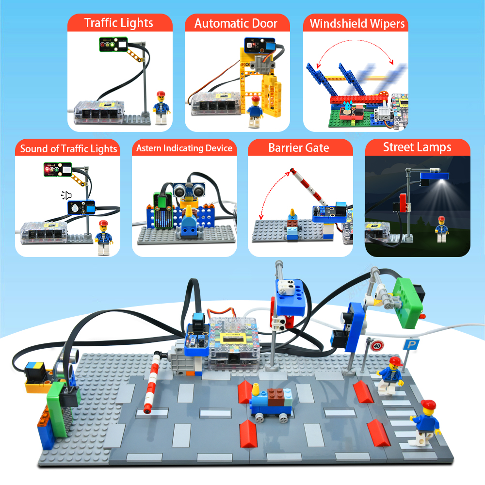

# Downlaod 

**Downlaod project code :[download Codes](Code.zip)**

# Introduction:

Based on Arduino and compatible with Lego series, intelligent traffic is a kidsbits STEM project dedicated to programming education for children aged 6-9. It integrates multitudes of sensors and modules such as traffic lights, a photoresistor, a white LED, a PIR motion sensor, a 8*8 dot matrix display and an active buzzer. In this connection, it is easy for you to DIY multiple intriguing projects including street lamps, an automatic door, windshield wipers as well as an integrated traffic system.

Just as important is that Scratch graphical programming software allows children to learn from the simplest codes and master systematic programming knowledge. Meanwhile, the Lego series can be used to build various shapes and inject some basic physics and mechanical knowledge to children, thus greatly boosting their logical analysis ability, creative ability, hands-on ability and problem-solving ability.

# Kit list:
| # | Component | QTY | Picture |
| :--: | :--: | :--: |:--: |
| 1 | Kidsuno Mainboard | 1 |  |
| 2 | Traffic Light Module | 1 |  |
| 3 | Active Buzzer | 1|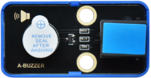 |
| 4 | Photoresistor |1 | 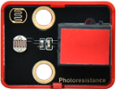 |
| 5 | White LED | 1 | 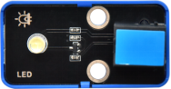 |
| 6 | PIR Motion Sensor | 1 | |
| 7 | Steam Sensor | 1 | |
| 8 | Obstacle Avoidance Sensor | 1 |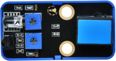 |
| 9 | 8×8 Dot Matrix Display | 1 | |
| 10 | Ultrasonic Adapter | 1 | |
| 11 | Ultrasonic Sensor | 1 | |
| 12 | 270° Servo | 1 |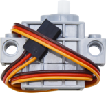 |
| 13 | USB Cable | 1 |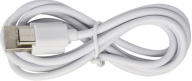 |
| 14 | 20cm Connection Wire | 4 | |
| 15 | 30cm Connection Wire | 3 |  |
| 16 | Battery Holder | 1 |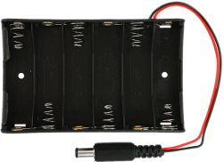 |
| 17 | Traffic Lights | 1 | |
| 18 | Sound of Traffic Lights | 1 |  |
| 19 | Street Lamps | 1 |  |
| 20 | Automatic Door | 1 |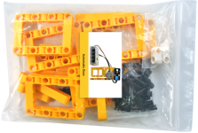 |
| 21 | Windshield Wipers | 1 |  |
| 22 | Barrier Gate | 1 |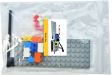 |
| 23 | Astern Indicating Device | 1 |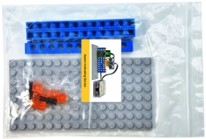 |
| 24 | Integrated Traffic System | 1 |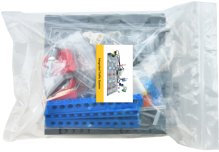 |

# Kidsuno Mainboard Introduction

 Introduction：
Arduino STEM electronic building block programming development controller is a board based on the ATmega328P microcontroller. It boasts 14 digital input or output pins (6 of which can be used as PWM output), 8 analog inputs (A4 and A5 as fixed I2C), two row pin ports, a USB port, a DC power port, a DC power switch, a reset button and a 128*64 OLED display.

Importantly, we enable to connect it to a computer via a USB-C cable, or use a DC adapter or batteries to power it.

 Parameters：
- Microcontroller：ATmega328P
- Operating Voltage：5V
- Input Voltage：USB:5V,DC:6-12V
- Digital I/O Pins：14(of which 6 provide PWM output
- PWM Digital I/O Pins：6
- Analog Input Pins：8（A4 and A5 as fixed I2C）
- DC Current per I/O Pin：20mA
- Flash Memory：32KB(ATmega328P)of which 0.5 KB used by bootloader
- SRAM：2KB(ATmega328P)
- EEPROM：1KB(ATmega328P)
- Total Current： The max output of USB power supply is 400mA，and DC is 1.6A
- Max Power：8W
- Clock Speed：16MHZ
- Dimensions：87.5mm×60mm×20mm
- Weight：37g(without housing)
- Operating Temperature Range：-10℃~50℃ 

 Schematic Diagram：

 Ports Description of Kidsuno Mainboard

 Mainboard External Battery Holder

The end of the battery holder with the spring is negative pole (-), and the other is positive pole (+). (AA batteries are not provided)

