# Kidsbits Intelligent Traffic System Kit for Arduino

**Note：The sensors and modules and the 270° servo in each project are shared.**
 
 
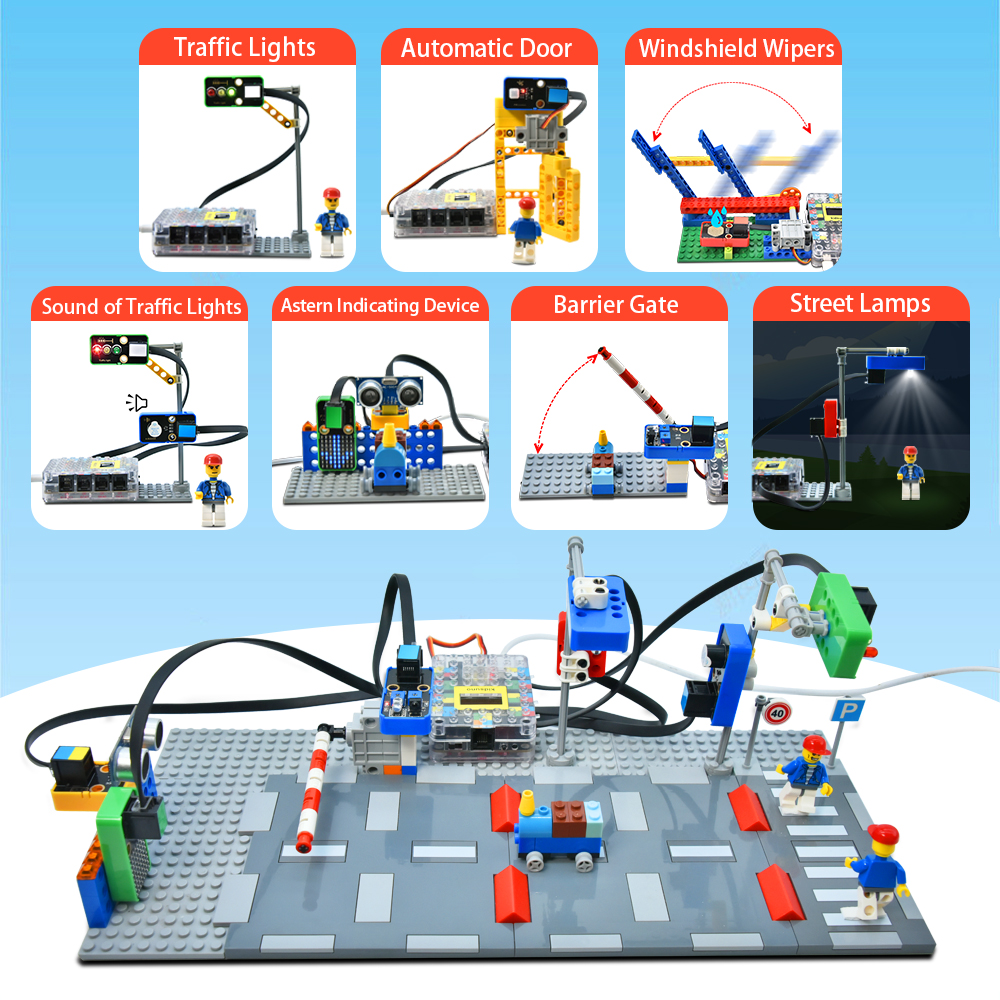

# 1.Product Introduction:

Based on Arduino and compatible with Lego series, intelligent traffic is a kidsbits STEM project dedicated to programming education for children aged 6-9. It integrates multitudes of sensors and modules such as traffic lights, a photoresistor, a white LED, a PIR motion sensor, a 8*8 dot matrix display and an active buzzer. In this connection, it is easy for you to DIY multiple intriguing projects including street lamps, an automatic door, windshield wipers as well as an integrated traffic system.

Just as important is that Scratch graphical programming software allows children to learn from the simplest codes and master systematic programming knowledge. Meanwhile, the Lego series can be used to build various shapes and inject some basic physics and mechanical knowledge to children, thus greatly boosting their logical analysis ability, creative ability, hands-on ability and problem-solving ability.

# 2.Kit:
| # | Component | QTY | Picture |
| :--: | :--: | :--: |:--: |
| 1 | Kidsuno Mainboard | 1 | 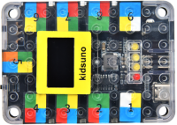 |
| 2 | Traffic Light Module | 1 | 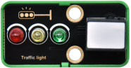 |
| 3 | Active Buzzer | 1|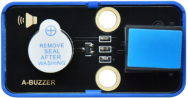 |
| 4 | Photoresistor |1 | 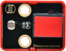 |
| 5 | White LED | 1 | 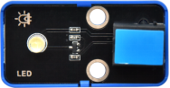 |
| 6 | PIR Motion Sensor | 1 |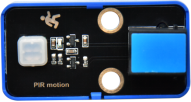 |
| 7 | Steam Sensor | 1 | |
| 8 | Obstacle Avoidance Sensor | 1 |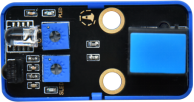 |
| 9 | 8×8 Dot Matrix Display | 1 |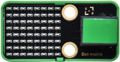 |
| 10 | Ultrasonic Adapter | 1 |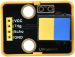 |
| 11 | Ultrasonic Sensor | 1 |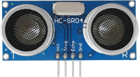 |
| 12 | 270° Servo | 1 |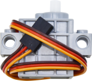 |
| 13 | USB Cable | 1 | |
| 14 | 20cm Connection Wire | 4 | |
| 15 | 30cm Connection Wire | 3 | 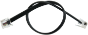 |
| 16 | Battery Holder | 1 |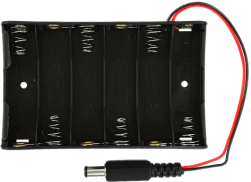 |
| 17 | Traffic Lights | 1 |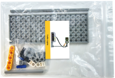 |
| 18 | Sound of Traffic Lights | 1 | 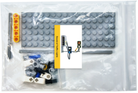 |
| 19 | Street Lamps | 1 | 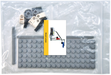 |
| 20 | Automatic Door | 1 |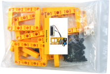 |
| 21 | Windshield Wipers | 1 | 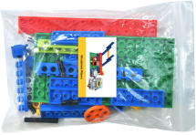 |
| 22 | Barrier Gate | 1 |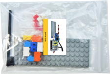 |
| 23 | Astern Indicating Device | 1 |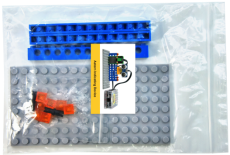 |
| 24 | Integrated Traffic System | 1 |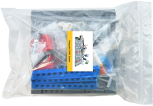 |

# 3.Tutorial:

- [1.Mainboard_Introduction](1.Mainboard_Introduction/Mainboard_Introduction.md)

- [2.Development_Environment_Configuration](2.Development_Environment_Configuration/Development_Environment_Configuration.md)

- [3.Projects](3.Projects/3.Projects.md)
  

- [4.Codes](4.Codes.zip)

