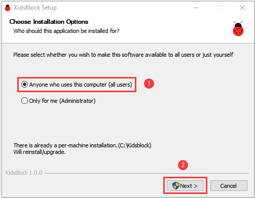
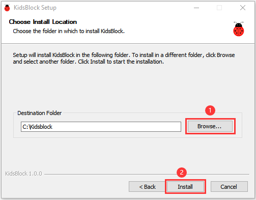
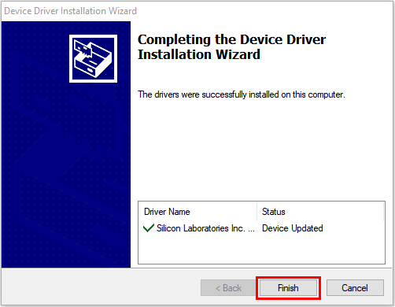
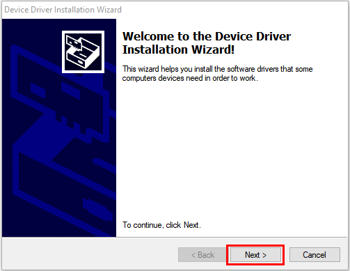
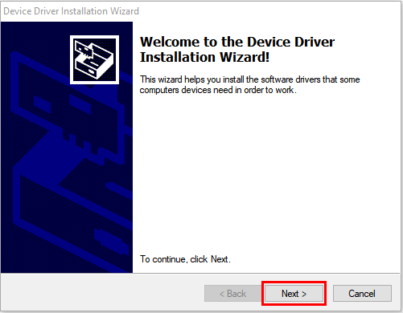
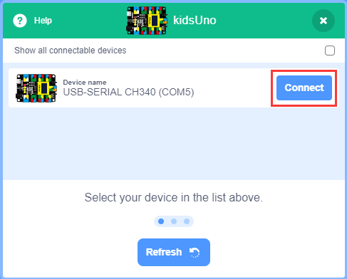
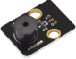

# Getting started with KidsBlock 

## Download KidsBlock Software

The Kidsblock, based on the Scratch graphical programming software, integrates multiple mainstream mainboards, sensors as well as modules. It can be programmed by dragging graphical blocks and using the C/C++ programming language, making programming easy and interesting for children to learn.

**[Windows system](https://www.kidsblock.cn/Down/KidsBlock.exe)**

**[MACOS system](https://www.kidsblock.cn/Down/KidsBlock-MACOS.dmg)**

**Install Kidsblock Software---windows**

1. Double click “KidsBlock Setup.exe”.

2. Click **Anyone who uses this computer(all users)** and **Next**.

3. Click **Browse（B）...** to choose the Disk where the software will be placed（here, we choose C Drive），then click **Install**.

 

4. After a few seconds, the installation is complete. Tap **Finish** to open the installed Kidsblock software.

5. If the computer security alert window appears, click **Allow access**, the interface of the software is below:

6. Update the latest version of the KidsBlock.

We can manually update the software in the Settings.

If it is the latest version, it will display.

**Install Kidsblock Software---MacOS**

1. Double-click KidsBlock icon，then drag KidsBlock Desktop to the Applications folder.

2. It’s installing the kidsblock program on your computer.

3. After the installation is finished, you will view the KidsBlock icon.

4. Click KidsBlock software icon to start the software, it shows that it can't be opened, because the default Apple computer only allows the installation of software in the App Store, other software is not allowed to install. Thus we need to modify the computer settings to start the software.

5. Open your computer's settings interface, click Privacy & Security, switch the security option to "App Store and identified developers", then click "Open Anyway".

6. Tap Open.

7. Open the software.

8. It is the software interface.

## How to use KidsBlock
（We will demonstrate how to use KidsBlock on Windows system（MacOS can refer to it）
 
 

1.Interface：

2.Click to switch to different languages.

3.Tap to select **Install driver**. As shown below:

A. Click **Next** at the **Device Driver Installation Wizard page**.

B. After a while, click **Finish**.

C. Then click **Next**.

D. And click **Finish**.

E. Then click **Allow** and **Install**.

F. After a while，click **Finish**.

G. Select **Extract**.

H. Click **Next**.

I. Next, click **I accept this agreement** and **Next**.

J. Click **Finish**.

K. After a while, click **INSTALL**.

O. After a few seconds, when the driver is installed, just click **OK**.

4.Click to enter the main page, and select the control board needed. In this project, we select the kidsUno mainboard and click **Connect**, then it is connected. Click Go to Editor to return the code editor. 

Icon will change into  and  will change into . This means the kidsUno mainboard and ports（COM）are connected. 

5.If the kidsUno mainboard is connected , but icon doesn’t change into . You need to click to connect the COM port.

Click. Then you will find a page pop up, showing Connected.

To disconnect the port, just click and Disconnect.

6.The kidsUno mainboard and the COM port are connected, then  automatically switches to .

Note：If you want to update libraries of KidsBlock, click then Clear cache and restart.

7.stands for extension libraries of sensors and modules. 
Click to enter the page of extension libraries, click a sensor or module to add. For example, if click the **passive buzzer** module,**Not loaded** will change into **Loaded**. Then the passive buzzer is added.

Click to return to the code editor. Then you can view the passive buzzer in the blocks area.

If you want to delete the **passive buzzer**, click to select the passive buzzer. Then **Loaded** will change into **Not loaded**. Then the passive buzzer is deleted.

The way of deleting other sensors or modules is as same as the passive buzzer.
 
 

8.How to open SB3 type files：

The first method：Double-click SB3 type files to open them.

For instance, open, then we need to double-click it.

The second method: Open Kidsblock，click **file** and **Load from your computer**，then select the SB3 type file on the computer.（for example）

Note：Please refer to the following link for MacOS：
[https://kidsblocksite.readthedocs.io/en/latest/](https://kidsblocksite.readthedocs.io/en/latest/)

**Note：The sensors, modules and the 270° servo in each project are shared.**

