# Projects

## Project 01：Traffic Lights

**Introduction**

I met a big traffic jam on my way to school today. The red light at the intersection where I waited lasted very long and the green light flashed a few times and then changed to yellow. It seems that there's something wrong with the traffic light's digital signal. 

Can we use a traffic light module to simulate the working principle of traffic lights?  

Let's take a look at the tools first.

**Components**

||||
| :--: | :--: | :--: |
|Kidsuno Mainboard×1|Traffic Light Module×1|Connection Wire×1|
||  | |
|USB Cable×1| Traffic Lights×1 | |

**Component Knowledge**

（1）Traffic lights are signal lights that command the traffic operation, which are generally composed of a red light, a green light and a yellow light. The red light means impassable, the green light means passable, and the yellow light means a warning.

（2）To keep the light on, the electricity is needed. When we say that there is electricity, we mean that there is current flowing through an electrical appliance like a light. Current comes to our home from the power station via wires. And the generator of a power station is the power supply, which enables to provide voltage and current. The battery we usually use is also the power supply. Wires can be used to conduct electricity, which connect a path for the current to flow. This path is called a circuit. If we want to make a lamp emit light, both a power supply and a complete circuit are needed.

**Installation of Traffic Lights**

|       |
|-------------------------------------------------------|

|   ×1   ×1 |
|------------------------------------------------------------------------------------------------------------------------------------------------------------|

|       |
|-------------------------------------------------------|

|     ×1 |
|------------------------------------------------------------------------------------------------------|

|         |
|---------------------------------------------------------|

|    ×1 |
|-----------------------------------------------------------------------------------------------------|

|       |
|-------------------------------------------------------|

|    ×1 |
|-----------------------------------------------------------------------------------------------------|

|     |
|-----------------------------------------------------|

|      ×1      ×1 |
|--------------------------------------------------------------------------------------------------------------------------------------------------------------|

|     |
|-----------------------------------------------------|

|     ×1  |
|-------------------------------------------------------------------------------------------------------|

|    ×2     ×1    ×1 |
|-----------------------------------------------------------------------------------------------------------------------------------------------------------------------------------------------------------------|

|         |
|---------------------------------------------------------|

|    ×1 |
|-----------------------------------------------------------------------------------------------------|

|    |
|----------------------------------------------------|

|     ×1 |
|------------------------------------------------------------------------------------------------------|

|     |
|-----------------------------------------------------|

|    ×2 |
|-----------------------------------------------------------------------------------------------------|

|    |
|----------------------------------------------------|

|     ×1 |
|------------------------------------------------------------------------------------------------------|

|    |
|----------------------------------------------------|

|   Prototype |
|-------------------------------------------------------------|

|   |
|---------------------------------------------------|

 Function: Light Up the Traffic Lights

 Wiring Diagram

Connect the kidsuno mainboard and computer via a USB cable, and connect the traffic light module to the No.1 interface of the mainboard.

 Description of the Building Blocks

Set **input** or **output** to the specified pin. **input** means input mode,**output** means output mode. Select **input-pullup** can set the input mode for the pin and make it become high level.

Set **high** or **low** to the specified pin. Select **high** means to set high level for the pin. If there is voltage and current, the LED will be on. Select **low** means to set low level for the pin. If there is no voltage and current, the LED will be off.

 Write the Program

① Drag the instruction block in the **Events** module to the script area.

② Drag the instruction block in the **Pins** module to the script area and copy it twice. Since the interface of the traffic light module is connected to port 1 on the mainboard (the red light is connected to D3, the yellow light is connected to D5, and the green light is connected to D6), then change the number 0 to 3, 5 and 6 and **input** to **output** respectively.

③ Drag the instruction block in the **Pins** module to the script area and copy it twice. Then change the number 0 to 3, 5, and 6 respectively.

④ Complete Program

 Test Result

Click  to upload the complete program to the kidsuno mainboard and power up, then the lights on the traffic light module will be on. It seems pretty amazing, right?

 Function: Make the Traffic Lights On and Off

 Description of the the Building Blocks

This is a delay block, and change the number 1 to the delayed time

 Write the Program

①  Write the program according to the knowledge learned before and refer to the last program code.

② Drag the instruction block in the **Control** module to the script area. The number 1 can be changed to other numbers. Here, the number 1 is taken as an example.

③ Copy the code string once and change **high** to **low**.

④ Complete Program

：Test Result 

Click  to upload the complete program to the kidsuno mainboard and power up, then the lights on the traffic light module will go on and then off.

 Function of Traffic Lights 

 Flow Chart 

First set the three LED lights to off, then the red light will be on for 5 s then go off, then the yellow light will flash for 3 times then go off, then the green light will be on for 5 s then go off.

 Description of the the Building Blocks

This is a loop statement: do a same thing over and over again.

This is a conditional loop control statement and it will exit the loop  when the number of loops is met. For example, 10 means 10 cycles, and the number 10 can be changed to other numbers.

 Write the Program

① Find the instruction blocks

（1）
 

（2）
 

（3）
 

② Complete Program

Test Result 

Click  to upload the complete program to the kidsuno mainboard and power up, then the red light will be on for 5 s then go off, then the yellow light will flash for 3 times then go off, then the green light will be on for 5 s then go off and continue the cycle.

 Extended Project

The extended sample code is below：

**Note：The sensors, modules and the 270° servo in each project are shared.**

## Project 02： Sound of Traffic Lights

 Introduction

Today, I was walking home from school when I saw the traffic light beep at the intersection. Can we add a sound to the traffic light module in project 01? Let's take a look at the tools first.

 Components

||||
| :--: | :--: | :--: |
|Kidsuno Mainboard×1|Traffic Light Module×1|Active Buzzer×1|
|||  |
|Connection Wire×2|USB Cable×1| Sound of Traffic Light×1 |

 Installation Steps

Components

Note: The color of the building blocks is subject to the actual object.

|       |
|------------------------------------------------------------|

|    ×1         ×1 |
|---------------------------------------------------------------------------------------------------------------------------------------------------------------|

|            |
|------------------------------------------------------------|

|    ×1 |
|-----------------------------------------------------------------------------------------------------|

|        |
|--------------------------------------------------------|

|   ×1 |
|----------------------------------------------------------------------------------------------------|

|        |
|--------------------------------------------------------|

|     ×1 |
|------------------------------------------------------------------------------------------------------|

|     |
|-----------------------------------------------------|

|    ×1       ×2 |
|-------------------------------------------------------------------------------------------------------------------------------------------------------------|

|     |
|-----------------------------------------------------|

|    ×1     ×1 |
|------------------------------------------------------------------------------------------------------------------------------------------------------------|

|       |
|-------------------------------------------------------|

|        1\*8（63mm） ×1  |
|------------------------------------------------------------------------------------------------------------------------|

|     |
|-----------------------------------------------------|

|  ×1   ×1|
|--------------------------------------------------------------------------------| 

|     |
|-----------------------------------------------------|

|     ×2 |
|------------------------------------------------------------------------------------------------------|

|     |
|-----------------------------------------------------|

|     ×1 |                |
|------------------------------------------------------------------------------------------------------|----------------|

|       |
|-------------------------------------------------------|

|       ×2 |
|--------------------------------------------------------------------------------------------------------|

|     |
|-----------------------------------------------------|

|    ×1 |
|-----------------------------------------------------------------------------------------------------|

|    |
|----------------------------------------------------|

|    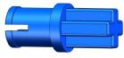 ×2 |
|------------------------------------------------------------------------------------------------------|

|    |
|----------------------------------------------------|

|   |
|--------------------------------------------------|

|    |
|----------------------------------------------------|

|    Prototype |
|--------------------------------------------------------------|

|   |
|---------------------------------------------------|

 Function: Make the Active Buzzer Sound

 Wiring Diagram
Connect the mainboard and computer via a USB cable, and connect the traffic light module to the No.1 interface of the mainboard and the active buzzer to the No.9 interface of the mainboard.

 Write the Program

① Drag the instruction block in the **Events** module to the script area.

② Drag the instruction block  in the **Pins** module to the script area. Since the interface of the active buzzer module is connected to the D10 pin of interface 9 on the mainboard, then change the number 0 to 10 and the **input** to **output**.

③ Drag the instruction block in the **Pins** module to the script area and change the number 0 to 10.

④ Complete Program

 Test Result

Click  to upload the complete program to the kidsuno mainboard and power up, then the active buzzer will sound. It seems pretty amazing, right?

 Function: Make the Active Buzzer Beep

 Write the Program

① change the **high** in the previous program to **low**.

② Drag the instruction block in the "**Control**" module to the script area. 

③ Drag the instruction block in the **Pins** module to the script area and change the number 0 to 10.

④ Drag the instruction block in the **Control** module to the script area. The number 1 can be changed to other numbers. Here, the number 0.5 is taken as an example.

⑤ Copy the code string once and change **high** to **low** .

⑥ Complete Program

 Test Result

Click  to upload the complete program to the kidsuno mainboard and power up, then the active buzzer will beep. It seems pretty amazing, right?

 Function: Sound of Traffic Lights 

 Flow Chart 

First the three LED lights will be off the buzzer will not beep, then the buzzer beeps and the red light flashes for 5 s then goes off , then the yellow light flashes for 3 times then goes off, then the green light will be on for 5 s then go off.

 Write the Program

① Find the instruction blocks

（1）
 

（2）
  

（3）
  
 
② Complete Program

 Test Result

Click  to upload the complete program to the kidsuno mainboard and power up, then the buzzer beeps and the red light flashes for 5 s then it won’t beep and the light will be off , then the yellow light flashes for 3 times then goes off, then the green light will be on for 5 s then go off.

 Extended Project

The sample code is below：

## Project 03：Street Lamps

 Introduction

Street lamps are ubiquitous in our daily life. For example, some public street lamps come on automatically at night and go off automatically during the day. Do you want to know why? Let’s make a small street lamp together. 

Look at the tools first.

 Components

||||
| :--: | :--: | :--: |
|Kidsuno Mainboard×1|Photoresistor×1|White LED Module×1|
|||  |
|Connection Wire×2|USB Cable×1| Street Lamps×1 |

 Installation Steps

Components

Note: The color of the building blocks is

subject to the actual object.

|         |
|---------------------------------------------------------|

|    ×1      ×1 |
|----------------------------------------------------------------------------------------------------------------------------------------------------------|

|         |
|---------------------------------------------------------|

|      ×1 |
|-------------------------------------------------------------------------------------------------------|

|      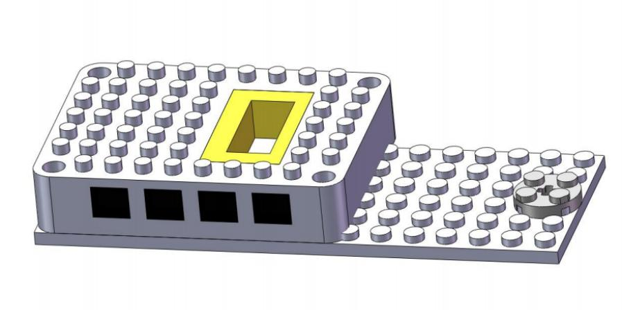 |
|-------------------------------------------------------|

|    ×1 |
|-----------------------------------------------------------------------------------------------------|

|     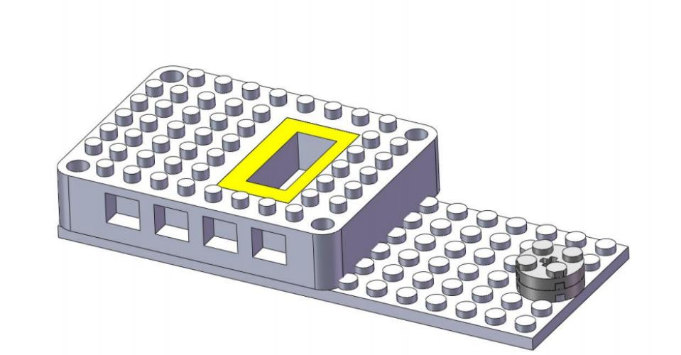 |
|------------------------------------------------------|

|     ×1 |
|------------------------------------------------------------------------------------------------------|

|      |
|------------------------------------------------------|

| 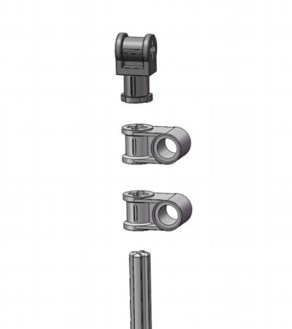   ×2       ×1 |
|--------------------------------------------------------------------------------------------------------------------------------------------------------------|

|   |
|---------------------------------------------------|

|    ×1 |
|-----------------------------------------------------------------------------------------------------|

|   |
|---------------------------------------------------|

|    ×2 |
|-----------------------------------------------------------------------------------------------------|

|   |
|---------------------------------------------------|

| 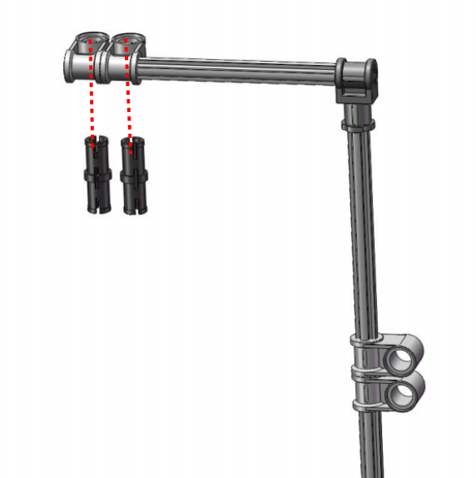   ×2 |
|-----------------------------------------------------------------------------------------------------|

|     |
|-----------------------------------------------------|

|    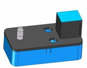 ×1 |
|------------------------------------------------------------------------------------------------------|

|   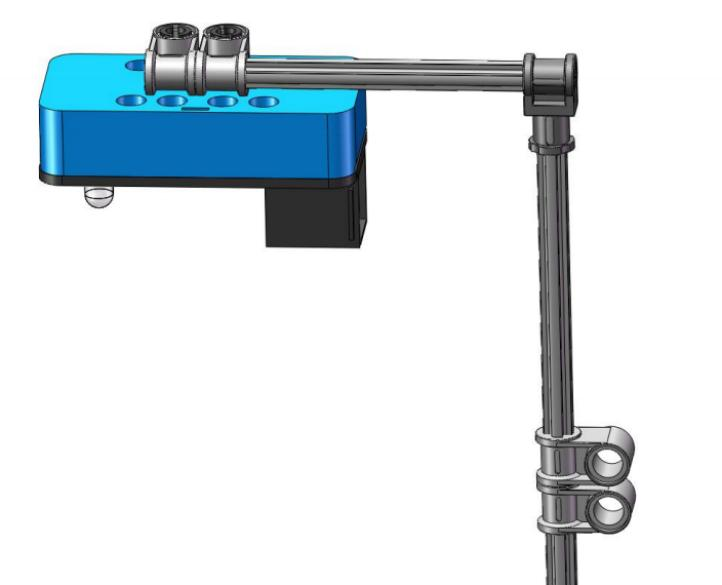 |
|----------------------------------------------------|

|     ×2 |
|------------------------------------------------------------------------------------------------------|

|    |
|----------------------------------------------------|

| 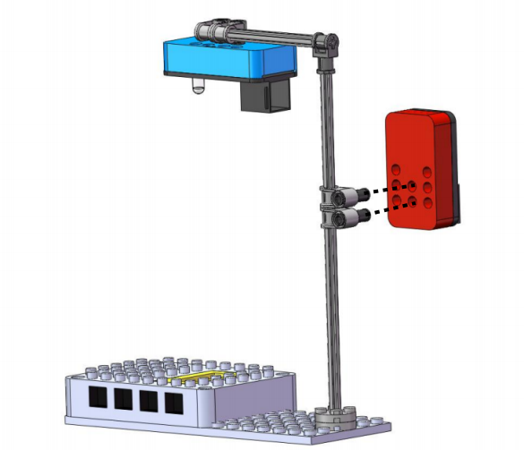  ×1 |
|----------------------------------------------------------------------------------------------------|

|      |
|------------------------------------------------------|

|   Prototype |
|-------------------------------------------------------------|

|    |
|----------------------------------------------------|

 Function: Detect the Light Intensity 

 Wiring Diagram
Connect the kidsuno mainboard and computer via a USB cable, and connect the photoresistor to the No.7 interface of the mainboard and the LED module to the No.1 interface of the mainboard.

 Description of the the Building Blocks

The block is used to set serial baud rate(generally, the baud rate 9600 is taken as an example)

This block is used to set print mode for the serial port. **warp** means line feed printing, **no-warp** means no line feed printing, **HEX** means hexadecimal printing.

It is used to read the analog signal value of the specified pin（range：0~1023)

 Write the Program

① Drag the instruction block in the **Events** module to the script area.

② Drag the instruction block in the **Serial** module to the script area and take the baud rate 9600 as an example.

③ Drag the instruction block in the **Pins** module to the script area. Since the photoresistor is connected to pin A0 of port 7 on the mainboard, then change the number 0 to A0.

④ Drag the instruction block  in the **Control** module to the script area. 

⑤ Drag the instruction block in the **Serial** module to the script area.

⑥ Drag the instruction block in the **Pins** module to the script area and put it into the block .

⑦ Drag the instruction block in the **Control** module to the script area and change the number 1 to 0.3.

⑧ Complete Program

 Test Result

Click  to upload the complete program to the kidsuno mainboard and power up, then click  in the serial monitor area to set the baud rate to 9600. Then the serial monitor will print the analog value read by the photoresistor. When the light intensity in the environment where the photoresistor is located gradually decreases, the analog value increases gradually, otherwise, the analog value decreases.

 

 Function: Photoresistor Controls LED

 Description of the the Building Blocks

It is a conditional statement code executing if-then-else function: If the logical judgment statement in  is satisfied, the code statement below **then** is executed, otherwise, the code below **else** is executed.

 Flow Chart 

First, set the LED to off. When the light intensity value read by the photoresistor is less than 200, the LED will be on, otherwise, it will be off.

 Write the Program

① Find the instruction blocks

（1）
  

（2）
 

（3）
 

（4）
 

（5）
 

② Complete Program

 Test Result

Click  to upload the complete program to the kidsuno mainboard and power up, then use your hands to cover the photoresistor . When the light intensity value read by the photoresistor is less than 200, the LED will be on, otherwise, it will be off.

 Extended Project

The sample code is below：

## Project 04：An Automatic Door

 Introduction

I find that there are many interesting inventions in our life. Last time I went to a library with my classmates to borrow a book about learning robots. When we came to the door, it opened automatically.

How magical it is! Today, let's make a device that can open the door automatically. 

Let’s look at the tools first.

 Components

||||
| :--: | :--: | :--: |
|Kidsuno Mainboard×1|PIR Motion Sensor×1|270°Servo×1|
|||  |
|Connection Wire×1|USB Cable×1| Automatic Door×1 |

 Function: Rotate the Servo

 Wiring Diagram

Connect the kidsuno mainboard and computer via a USB cable, and connect the servo to the G, V and D13 interface of the mainboard. The brown wire is connected to G, the red wire is connected to V and the orange wire is connected to D13.

 Add the Servo Instruction Module

Diagram of the **Extension** Instruction Block

Add **Servo**

 Description of the the Building Blocks

Set the rotation angle of the servo and the delayed time for a specified pin

 Write the Program

① Drag the instruction block in the **Events** module to the script area.

② Drag the instruction block  in the **Pins** module to the script area. Since the servo is connected to port G, V and D13 on the mainboard, then change the number 0 to 13 and the **input** to **output**.

③Drag the instruction block  in the **servo** module to the script area, then change the number 3 to 13 and the angle number 90 to 93, the delay of 200 remains unchanged.

④ Drag the instruction block  in the **Control** module to the script area.

⑤ Drag the instruction block  in the **servo** module to the script area, then change the number 3 to 13, the angle number 90 to 93 and the delay of 200 to 500.

⑥ Copy the instruction block 3 times in the block and place them into it, then change the angle number 93 to 62, 31 and 0.

⑦ Complete Program

 Test Result

Click  to upload the complete program to the kidsuno mainboard and power up, then the servo will rotate from 93°to 62° to 31° to 0° and rotate from 0° to 31° to 62° to 93°.

 Installation Steps

Components

Note: The color of the building blocks is subject to the actual object.

|   |
|---------------------------------------------------|

|       **×4**       **×2** |
|----------------------------------------------------------------------------------------------------------------------------------------------------------------------------------------------------------------------|

|        **×2** |
|-----------------------------------------------------------------------------------------------------------------------------------------------------------|

|    **×4**   |
|----------------------------------------------------------------------------------------------------------------------------------------------------------|

|   **×2** |                                                    |
|---------------------------------------------------------|----------------------------------------------------|
|          |    |

|   **×2** |                                                   |
|----------------------------------------------------------|---------------------------------------------------|
|           |   |

|      **×1**     |
|-------------------------------------------------------------------------------------------------------------------------------------------------------------|

|        **×4** |           |          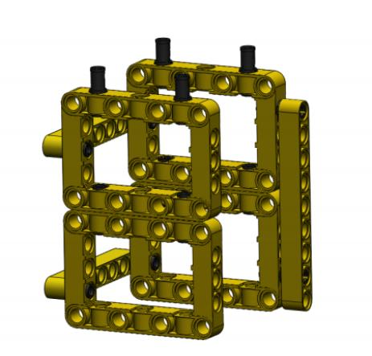 |
|---------------------------------------------------------------|----------------------------------------------------------|-----------------------------------------------------------|

|    **×1**   |             |
|----------------------------------------------------------------------------------------------------------|-------------------------------------------------------------|

|    **×2**    |
|-----------------------------------------------------------------------------------------------------------------------------------------------------------|

|   **×1**   |
|--------------------------------------------------------------------------------------------------------------------------------------------------------|

|   **×2** |                                                    |
|----------------------------------------------------------|----------------------------------------------------|
|           |    |

|    **×1**   |
|----------------------------------------------------------------------------------------------------------------------------------------------------------|

| Before installing the servo, please initialize its angle                            |                                                    |
|-------------------------------------------------------------------------------------|----------------------------------------------------|
|                                      |    |
|   Code for initializing the servo   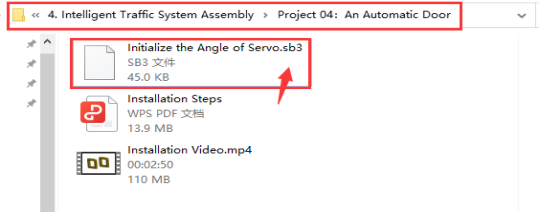 |                                                    |

|    **×1**   |
|---------------------------------------------------------------------------------------------------------------------------------------------------------|

|    **×2**   |
|----------------------------------------------------------------------------------------------------------------------------------------------------------|

|    **×1**   |             |
|----------------------------------------------------------------------------------------------------------|-------------------------------------------------------------|

|             Installation Diagram |     |
|----------------------------------|----------------------------------------------------------------------------------------------------|

|   |
|---------------------------------------------------|

|   |
|---------------------------------------------------|

|  |
|--------------------------------------------------|

|     ×2   |
|-------------------------------------------------------------------------------------------------------------------------------------------------------|

|    ×1    |
|------------------------------------------------------------------------------------------------------------------------------------------------------|

|    ×2    |
|-------------------------------------------------------------------------------------------------------------------------------------------------------|

|        ×1 |          |            |
|----------------------------------------------------------|---------------------------------------------------------|------------------------------------------------------------|

|   ×2 |   ×1 |
|------------------------------------------------------|-----------------------------------------------------|
|       |     |

| 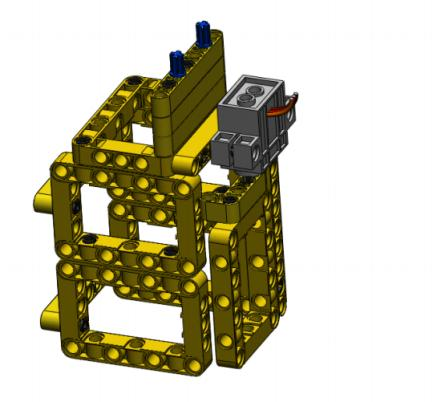  ×2    |
|-----------------------------------------------------------------------------------------------------------------------------------------------------|

|       ×2 |          |            |
|----------------------------------------------------------|---------------------------------------------------------|------------------------------------------------------------|

|   ×2   |
|-----------------------------------------------------------------------------------------------------------------------------------------------------|

|   ×1  |
|---------------------------------------------------------------------------------------------------------------------------------------------------|

|      Prototype   |
|----------------------------------------------------------------------------------------------------------------|

 Wiring Diagram

Connect the kidsuno mainboard and computer via a USB cable, and connect the servo to the G, V and D13 interface of the mainboard and the PIR motion sensor to the No.1 interface of the mainboard.

The brown wire is connected to G, the red wire is connected to V and the orange wire is connected to D13.

 Function: Read the PIR Motion Sensor

 Description of the the Building Blocks

This is the digital signal (0 or 1) for a specified pin.

 Write the Program

① Drag the instruction block  in the **Events** module to the script area.

② Drag the instruction block  in the **Serial** module to the script area and take the baud rate 9600 as an example.

③  Drag the instruction block  in the **Pins** module to the script area. Since the PIR motion sensor is connected to pin D5 of port 1 on the mainboard, then change the number 0 to 5.

④ Drag the instruction block  in the **Control** module to the script area. 

⑤ Drag the instruction block  in the **Serial** module to the script area.

⑥ Drag the instruction block  in the **Pins** module to the script area and put it into the block , then change number 0 to 5.

⑦ Drag the instruction block  in the **Control** module to the script area and change the number 1 to 0.3.

⑧ Complete Program

 Test Result

Click to upload the complete program to the kidsuno mainboard and power up, then click  in the serial monitor area to set the baud rate to 9600. When the PIR motion sensor detects a person or animal moving, the serial monitor prints a digital signal 1, otherwise it prints 0.

 Function: PIR Motion Sensor Controls the Servo

 Flow Chart 

First, set the angle of the servo to 93°. When the PIR motion sensor detects a person or animal passing by, it will rotate to 0° and it will not rotate if no man or animal is passing by.

 Write the Program

① Find the instruction blocks

（1）
   

（2）
 

（3）
 

（4）
 

（5）
 

（6）
 

② Complete Program

 Test Result

Click to upload the complete program to the kidsuno mainboard and power up. When the PIR motion sensor detects a person or animal passing by, it will rotate to 0° and the door will be opened automatically , and it will not rotate if no man or animal is passing by and the door will not be opened.

 Extended Project

The sample code is below：

## Project 05：Windshield Wipers

 Introduction

Our family drove out for a trip at the weekend, however, it suddenly rained heavily on the way home. My father turned on the windshield wipers and the rain on the front glass of the car was constantly scraped away. Let’s explore the reason!

 Components

||||
| :--: | :--: | :--: |
|Kidsuno Mainboard×1|Steam Sensor×1|270°Servo×1|
|||  |
|Connection Wire×1|USB Cable×1| Windshield Wipers×1 |

 Installation Steps

Please refer to the following link：https://www.dropbox.com/scl/fo/whacdlki5y44kevau03qa/h?dl=0&rlkey=ogbigsw7lxv8zhkvr1oqhlkmz

 Function: Steam Sensor Detects Water

 Wiring Diagram

Connect the kidsuno mainboard and computer via a USB cable, and connect the servo to the G, V and D13 interface of the mainboard and the steam sensor to the No.7 interface of the mainboard.
The brown wire is connected to G, the red wire is connected to V and the orange wire is connected to D13.

 Write the Program

① Drag the instruction block  in the **Events** module to the script area.

② Drag the instruction block  in the **Serial** module to the script area and take the baud rate 9600 as an example.

③ Drag the instruction block  in the **Pins** module to the script area. Since the steam sensor is connected to pin A0 of port 7 on the mainboard, then change the number 0 to A0.

④ Drag the instruction block  in the **Control** module to the script area. 

⑤ Drag the instruction block  in the **Serial** module to the script area.

⑥ Drag the instruction block  in the **Pins** module to the script area and put it into the block.

⑦ Drag the instruction block in the **Control** module to the script area and change the number 1 to 0.3.

⑧ Complete Program

 Test Result

Click  to upload the complete program to the kidsuno mainboard and power up, then click in the serial monitor area to set the baud rate to 9600. When we drip water gradually into the metal detection area of the steam sensor, the analog number will increase gradually.

 Function: Steam Sensor Controls the Servo

 Flow Chart

First, set the angle of the servo to 0°. When the analog value of the steam  sensor is greater than 200, the servo will rotate back and forth at 0-100°, otherwise, it will not rotate and the angle of the servo will be 0°.

 Add the Servo Instruction Module

 Description of Building Blocks 

This is the variable module. Let’s look at it! 
 
 

There are commonly used **declare global numeric variable type integer name assigned to 0**, **variable** and **Set variable to 0** instruction squares:

When you need to use this variable, drag the block directly into the script area to edit it!

 Write the Program

① Find the instruction blocks

（1）
  

（2）
   

（3）
 

（4）
 

（5）
 

（6）
 

（7）
 

（8）
 

② Complete Program

 Test Result

Click to upload the complete program to the kidsuno mainboard and power up. Dripping water gradually into the metal detection area of the steam sensor, if the analog value is greater than 200, the servo will rotate back and forth at 0-100° and the windshield wipers will swing, otherwise, it will not rotate and the wipers will not swing.

 Extended Project

The sample code is below：

## Project 06：Barrier Gate

 Introduction

Last time my dad drove me to eat seafood, however, when our car came to the barrier gate of the parking lot, the gate rose automatically, and when the car passed, it fell automatically. 

Maybe you're as curious about this device as I am, let’s make a barrier gate can automatically rise and fall together!
 
The following are the tools we need.

 Components

||||
| :--: | :--: | :--: |
|Kidsuno Mainboard×1|Obstacle Avoidance Sensor×1|270°Servo×1|
|||  |
|Connection Wire×1|USB Cable×1| Barrier Gate×1 |

 Installation Steps

Please refer to the following link：https://www.dropbox.com/scl/fo/whacdlki5y44kevau03qa/h?dl=0&rlkey=ogbigsw7lxv8zhkvr1oqhlkmz

 Function: Read the Obstacle Avoidance Sensor

 Wiring Diagram

Connect the kidsuno mainboard and computer via a USB cable, and connect the servo to the G, V and D13 interface of the mainboard and the obstacle avoidance sensor to the No.1 interface of the mainboard.

Note: The brown wire is connected to G, the red wire is connected to V and the orange wire is connected to D13.

 Write the Program

① Drag the instruction block  in the **Events** module to the script area.

② Drag the instruction block  in the **Serial** module to the script area and take the baud rate 9600 as an example.

③ Drag the instruction block in the **Pins** module to the script area. Since the obstacle avoidance sensor is connected to pin D5 of port 1 on the mainboard, then change the number 0 to 5.

④ Drag the instruction block  in the **Control** module to the script area.

⑤ Drag the instruction block  in the **Serial** module to the script area.

⑥ Drag the instruction block  in the **Pins** module to the script area and put it into the block, then change the number 0 to 5.

⑦ Drag the instruction block  in the **Control** module to the script area and change the number 1 to 0.3.

⑧ Complete Program

 Test Result

Click to upload the complete program to the kidsuno mainboard and power up, then click  in the serial monitor area to set the baud rate to 9600. When the obstacle avoidance sensor detects an obstacle, the serial monitor will print a digital signal 0, otherwise, it will print 1.

 Function: Obstacle Avoidance Sensor Controls the Servo

 Flow Chart 

First, set the angle of the servo to 32°. When the obstacle avoidance sensor detects an obstacle, the servo will rotate to 100°, otherwise it will not rotate.

 Add the Servo Instruction Module

 Write the Program

① Find the instruction blocks

（1）
  

（2）
 

（3）
 

（4）
 

（5）
 

（6）
 

（7）
 

（8） 
 

② Complete Program

 Test Result

Click to upload the complete program to the kidsuno mainboard and power up. When the obstacle avoidance sensor detects an obstacle, the servo will rotate to 100° and the barrier gate will open, otherwise it will not rotate and the barrier gate will close.

## Project 07：Astern Indicating Device

 Introduction

With the development of science and technology, cars boast the ability of intelligent environment perception, which can automatically analyze the safety and danger when driving. 

For example, we can observe the specific situation behind the car if we turn on the astern indicating device when backing up, which can avoid the car being knocked. Let’s make an astern indicating device together!
 
The following are the tools we need.

 Components

||||  |
| :--: | :--: | :--: | :--: |
|Kidsuno Mainboard×1|Ultrasonic Adapter Board×1|Ultrasonic Sensor×1| Astern Indicating Device×1 |
|||| |
|8×8 Dot Matrix Display×1|Connection Wire×2|USB Cable×1| |

 Installation Steps

Please refer to the following link：https://www.dropbox.com/scl/fo/whacdlki5y44kevau03qa/h?dl=0&rlkey=ogbigsw7lxv8zhkvr1oqhlkmz

 Function: 8*8 Dot Matrix Displays Expression Patterns

 Wiring Diagram

Connect the kidsuno mainboard and computer via a USB cable. Then connect the 8×8 dot matrix module to the No.8 interface of the mainboard and the ultrasonic adapter board to the No.9 interface of the mainboard. The Vcc, Trig, Echo, and Gnd of the ultrasonic sensor correspond to the same port of the ultrasonic adapter board.

 Add the Instruction Library of the 8*8 Dot Matrix

To use the 8×8 dot matrix , we need to call the "Display" module in the "Extension" function. Click "Matrix 8*8 IIC" then tap  to return to the programming interface.

**Extension** Instruction 

Add **Matrix 8*8 IIC** Display                        

 Write the Program

① Drag the instruction block in the **Events** module to the script area.

② Click the **Matrix HT16K33** module on the left of the instruction area, then all the 8*8 dot matrix instruction blocks will be displayed.

③ Drag the instruction block and  in the **Matrix HT16K33** module to the script area.

④ Drag the instruction block  in the **Control** module to the script area.

⑤ Drag the instruction block , and  in the **Matrix HT16K33** module to the script area.

⑥ Drag the instruction block  in the **Control** module to the script area and change the number 1 to 2.

⑦ Copy the instruction block10 times and put them into the block  respectively, then change the expression pattern  to.

⑧ Complete Program

 Test Result

Click to upload the complete program to the kidsuno mainboard and power up, then the the 8*8 dot matrix will display colorful expression patterns.

 Function：Ultrasonic Sensor Detects Distance

 Add the Instruction Library of the Ultrasonic Sensor

To use the ultrasonic sensor , we need to call the **Sensor** module in the **Extension** function. Click **Ultrasonic** then tap  to return to the programming interface.

**Extension** Instruction 

Add **Ultrasonic** Sensor

 Description of the the Building Blocks

This is the ultrasonic sensor instruction block used to measure the distance for the specified pin. The distance unit can be selected as cm or inch.

 Write the Program

① Drag the instruction block in the **Events** module to the script area.

②  Drag the instruction block  in the **Serial** module to the script area and take the baud rate 9600 as an example.

③ Drag the instruction block  in the **Pins** module to the script area and copy once. Since the ultrasonic sensor is connected to port 9 on the mainboard(Trig corresponds to pin D10 and Echo corresponds to pin D11), then change the number 0 to 10 and 11, and change the input behind number 10 to output.

④ Drag the instruction block  in the **Control** module to the script area.

⑤ Drag the instruction block  in the **Serial** module to the script area.

⑥ Drag the instruction block  in the **Ultrasonic** module to the script area and put it into the block, then change the number 2 to 10, 6 to 11, and take the distance unit cm as an example.

⑦ Drag the instruction block  in the **Control** module to the script area and change the number 1 to 0.3.

⑧ Complete Program

 Test Result

Click to upload the complete program to the kidsuno mainboard and power up, then click in the serial monitor area to set the baud rate to 9600.

Moving your hand in front of the ultrasonic sensor, the distance displayed becomes smaller when we are close to the sensor and larger when we are far away from it.

 Function: Ultrasonic Sensor Controls the 8*8 Dot Matrix

 Flow Chart 

Initialize the 8*8 dot matrix and read the distance value of the ultrasonic sensor. If the distance is greater than 0 and less than 10cm, the 8*8 dot matrix shows a "stop" pattern, otherwise, it displays a "backward" pattern.

 Write the Program

① Find the instruction blocks

（1）
 

（2）
 

（3）
 

（4）
 

（5）
 

（6）
 

（7）
 

（8）
 

（9）
 

② Complete Program

 Test Result

Click to upload the complete program to the kidsuno mainboard and power up. When the ultrasonic sensor detects the object within a range of 0cm to 10cm, the 8*8 dot matrix shows a "Stop" pattern, otherwise, it displays a "backward" pattern.

 Extended Project

The sample code is below：

## Project 08：Intelligent Integrated Traffic System

 Introduction

We have learned a host of projects before, can we put them together to make an integrated traffic system？Maybe you can't wait to do it，let’s get started!

The following are the tools we need.

 Components

|||||
| :--: | :--: | :--: | :--: |
|Kidsuno Mainboard×1|Traffic Light Module×1|Active Buzzer×1|Photoresistor×1|
|||||
|Obstacle Avoidance Sensor×1|Ultrasonic Adapter×1|Ultrasonic Sensor×1|8×8 Dot Matrix Display×1|
||||| 
|White LED×1|270°Servo×1|20cm Connection Wire×4|30cm Connection Wire×3| 
|| | | |
USB Cable×1|Integrated Traffic System×1 | | |

 Function: Make An Integrated Traffic System

 Installation Steps 

Please refer to the following link：https://www.dropbox.com/scl/fo/whacdlki5y44kevau03qa/h?dl=0&rlkey=ogbigsw7lxv8zhkvr1oqhlkmz

 Wiring Diagram

|Module|Kidsuno Mainboard|Module|Kidsuno Mainboard|
| :--: | :--: | :--: | :--: |
|Traffic Lights|Port 1(Red light→D3,Yellow light→D5,Green light→D6)|Active Buzzer|Port 6(D4)|
|Servo|Brown wire→G,Red wire→V,Yellow wire→D13|Obstacle Avoidance Sensor|Port 7(D8)|
|8×8 Dot Matrix|Port(5V, SDA, SCL, GND）|Photoresistor|Port 3(A3)|
|LED Module|Port 4(D2)|Ultrasonic Adapter Board|Port 9(Trig→D10, Echo→D11)|

 

| Ultrasonic Sensor | Ultrasonic Adapter |
| :--: | :--: |
| Vcc | VCC |
| Trig | Trig |
| Echo | Echo |
| Gnd | GND |

 Add the Servo, Ultrasonic Sensor and 8*8 Dot Matrix Instruction Module

 

**Extension** Instruction 
 

Add **Servo** Module

Add **Ultrasonic** Sensor

Add **Matrix 8*8 IIC** Display

 Flow Chart

 Write the Program

 Test Result

Click to upload the complete program to the kidsuno mainboard and power up. Then the effect of the intelligent integrate traffic system will appear.

